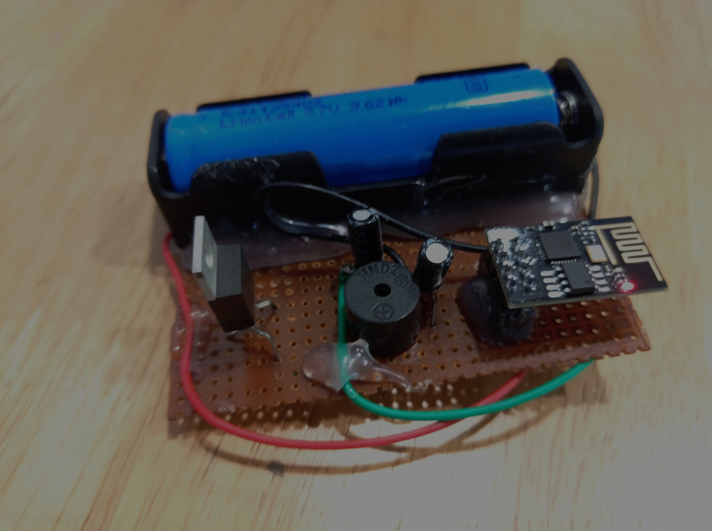

# SMART KEY FINDER
Many times we misplace our keys and go searching for them everywhere in the house, and after a long search, we end up finding them with much distress. Smart Key Chain just using ESP8266-01, Buzzer, and Battery. Now in case if you can’t find your keys and you remember that you have attached an IoT keychain to your keys, so you take out your phone and open Chrome and open your Keychain Webpage and by clicking on toggle button, you can find your keys by allowing the buzzer to give you a beep sound. 
           
 We are using the ESP8266 -01,a Wi-Fi module that allows microcontroller access to a Wi-Fi network. This module is a self-contained SOC (System On a Chip) that doesn’t necessarily need a microcontroller to manipulate inputs and outputs as you would normally do with an Arduino. An AMS1117 3.3V Voltage Regulator offers thermal shut down and current limit functions, to assure the stability of chip and power system. And a buzzer to convert the signals into beep sound. Lithium Polymer battery for power supply to the circuit. 10µf Capacitor is  used as filters in devices in various power supplies to reduce the voltage ripple as well as input and output smoothing .
 
 Now that we have assembled the PCB and uploaded the code on ESP8266-01, we are ready to test the keychain. For that power, the setup and wait until ESP connects to Wi-Fi, then get the ESP IP address. Now open your favorite browser and type in the IP address and search. Click on the ‘Click Me’ toggle button and the Buzzer will make a sound until you click on the button again.

## Photos

